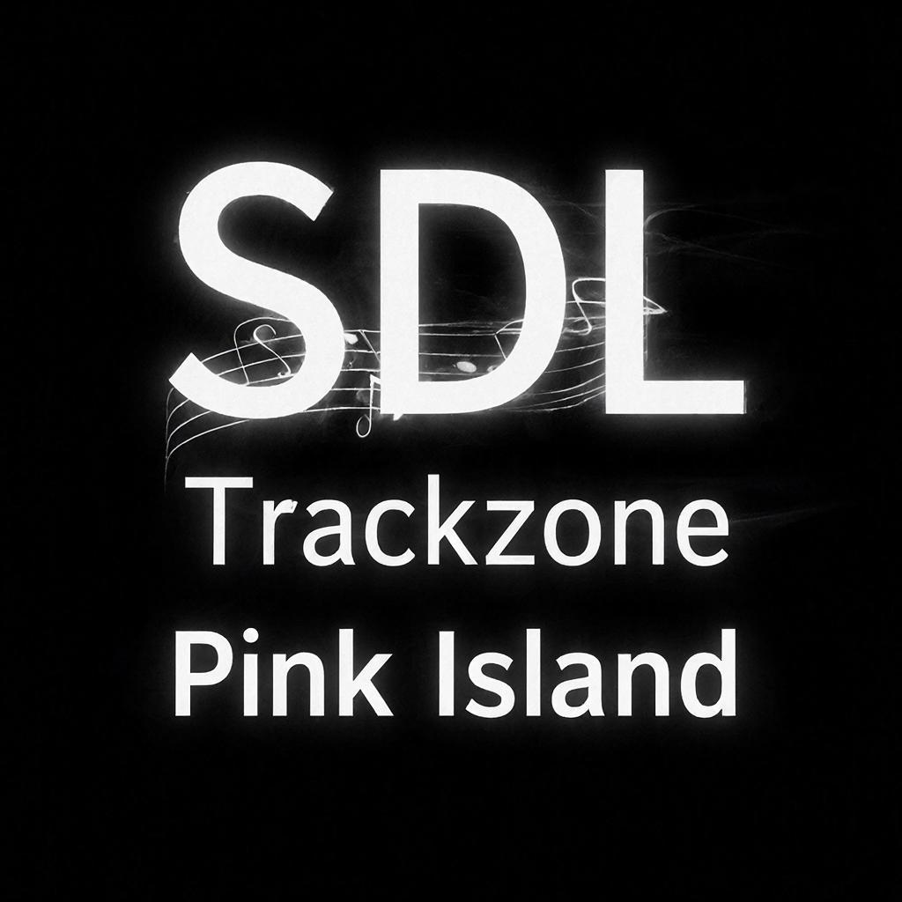

Вот готовый `README.md` для вашего проекта. Он описывает весь функционал, технологии, установку и настройку, включая безопасный чат. Вы можете скопировать его и положить в корень репозитория.

```markdown
# 🎵 Sacred De Lacrua — официальный сайт композитора

[](https://php.net)
[](https://nginx.org)
[](https://sqlite.org)
[](LICENSE)

> **Музыка как отражение души** — официальный сайт композитора и музыканта **Sacred De Lacrua (Виталий Кузьмин)**.  
> Проект включает: динамическую музыкальную библиотеку, галерею, защищённый чат, адаптивный дизайн, переключение языков (RU/EN).



---

## ✨ Особенности

- 🎨 **Современный дизайн** — тёмная тема, плавные анимации, адаптив под все устройства.
- 🎵 **Динамическая музыка** — все MP3 из папок подхватываются автоматически (без правки кода).
- 🖼️ **Галерея изображений** — слайдер с фотографиями.
- 🎤 **Аудиоплеер** — с прогресс-баром, перемоткой, сохранением позиции воспроизведения.
- 🌍 **Два языка** — русский и английский (переключение на лету).
- 💬 **Защищённый чат** — авторизация по паролю, CSRF-защита, rate limiting, экранирование вывода, запрет доступа к БД.
- 🚀 **Производительность** — ленивая загрузка изображений, кэширование статики, сжатие gzip.

---

## 🧰 Технологии

| Компонент       | Технология                         |
|----------------|------------------------------------|
| Сервер         | Nginx 1.24, PHP 8.3-FPM, SQLite 3 |
| Фронтенд       | HTML5, CSS3, JavaScript (ES6)      |
| Динамика       | Fetch API, AJAX, Web Audio API     |
| Безопасность   | password_hash(), CSRF-токены, сессии |
| Хостинг        | VPS Ubuntu 24.04, проброс портов NAT |

---

## 📁 Структура проекта

```
sacred-de-lacrua/
├── assets/                     # медиафайлы
│   ├── Music/                  # папки со стилями (Experemental/, Sacreddelacrua/, ...)
│   ├── Pictures/               # изображения (обложки, Real/, ...)
│   └── ...
├── index.html                  # главная страница
├── style.css                   # стили
├── script.js                   # фронтенд-логика (плеер, слайдер, переводы)
├── music_api.php               # API для динамической загрузки музыки
├── chat_login.php              # страница входа в чат
├── chat_room.php               # комната чата
├── chat_api.php                # API чата (получение сообщений)
├── chat_logout.php             # выход из чата
├── chat.db                     # база данных SQLite (создаётся автоматически)
└── private/                    # (вне DOCUMENT_ROOT) конфиги с хешем пароля
    └── chat_config.php
```

---

## 🔧 Установка и настройка (для вашего VPS)

### 1. Требования
- Ubuntu 22.04 / 24.04
- Nginx
- PHP 8.3 + модули: `php-fpm`, `php-sqlite3`
- SQLite3
- Git (опционально)

### 2. Клонирование репозитория
```bash
git clone https://github.com/yourusername/sacred-de-lacrua.git /var/www/html
cd /var/www/html
```

### 3. Настройка Nginx
Пример конфигурации (`/etc/nginx/sites-available/sdltech.tech`):

```nginx
server {
    listen 80;
    listen [::]:80;
    server_name sdltech.tech www.sdltech.tech;

    root /var/www/html;
    index index.html index.php;

    location / {
        try_files $uri $uri/ =404;
    }

    location ~ \.php$ {
        include snippets/fastcgi-php.conf;
        fastcgi_pass unix:/var/run/php/php8.3-fpm.sock;
    }

    location ~ \.db$ {
        deny all;
        return 403;
    }

    location ~ ^/assets/(Music|Pictures)/ {
        autoindex off;
    }
}
```

Активируйте сайт и перезагрузите Nginx:
```bash
ln -s /etc/nginx/sites-available/sdltech.tech /etc/nginx/sites-enabled/
nginx -t && systemctl reload nginx
```

### 4. Настройка PHP и базы данных чата
```bash
apt install php-fpm php-sqlite3 sqlite3
cd /var/www/html
sqlite3 chat.db "CREATE TABLE messages (id INTEGER PRIMARY KEY AUTOINCREMENT, username TEXT, message TEXT, created_at DATETIME DEFAULT CURRENT_TIMESTAMP);"
chown www-data:www-data chat.db
chmod 660 chat.db
```

### 5. Безопасность чата
Создайте каталог для конфигов вне `html`:
```bash
mkdir /var/www/private
php -r "echo password_hash('ваш_пароль', PASSWORD_DEFAULT);"
# скопируйте хеш
nano /var/www/private/chat_config.php
```

Содержимое `chat_config.php`:
```php
<?php
define('CHAT_PASSWORD_HASH', 'ваш_хеш_здесь');
```

Установите права:
```bash
chmod 600 /var/www/private/chat_config.php
```

### 6. Настройка прав на файлы
```bash
chown -R www-data:www-data /var/www/html
chmod -R 755 /var/www/html
```

### 7. Открытие портов (если сервер за NAT)
В панели управления VPS (Proxmox и т.п.) пробросьте порты **80** и **443** на внутренний IP вашей VM.

### 8. Получение SSL-сертификата (опционально)
```bash
apt install certbot python3-certbot-nginx -y
certbot --nginx -d sdltech.tech -d www.sdltech.tech
```

---

## 🎮 Использование

- **Главная страница** — приветствие, биография, стили музыки.
- **Музыка** — карточки стилей, при клике на ▶ воспроизводится первый трек из папки.
- **Галерея** — слайдер с фотографиями.
- **Чат** — доступ по паролю, защищён от XSS и CSRF, ограничена частота сообщений.
- **Аудиоплеер** — фиксированный внизу, показывает текущий трек, позволяет перематывать.
- **Переключение языка** — RU/EN, сохраняется в localStorage.

---

## 🔒 Безопасность (реализовано)

| Мера | Описание |
|------|----------|
| Хеширование пароля | `password_hash()` + `password_verify()` |
| CSRF-защита | Токен в форме, проверка при отправке |
| Rate limiting | Не чаще 1 сообщения в 5 секунд |
| XSS-защита | `htmlspecialchars()` на сервере и клиенте |
| Защита БД | Файл `chat.db` запрещён в Nginx, права 660 |
| Защита от подбора | Задержка 1 сек при неверном пароле |
| Сессии | `session_regenerate_id()` после логина |

---

## 🛠️ Разработка и доработки

### Добавление новой музыки
Просто положите MP3-файлы в соответствующую папку внутри `assets/Music/Название_стиля/`.  
Сайт автоматически подхватит их через `music_api.php`.

### Добавление фото в галерею
Поместите JPG в `assets/Pictures/Real/` и добавьте имя файла в массив `photoFiles` в `script.js`.

### Смена пароля чата
Сгенерируйте новый хеш:
```bash
php -r "echo password_hash('новый_пароль', PASSWORD_DEFAULT);"
```
Обновите `CHAT_PASSWORD_HASH` в `/var/www/private/chat_config.php`.

---

## 🐛 Возможные проблемы и решения

| Проблема | Решение |
|----------|---------|
| Не воспроизводятся MP3 | Убедитесь, что пути в `music_api.php` верны, и файлы имеют расширение `.mp3` |
| Чат не загружается | Проверьте права на `chat.db` (должен быть `www-data`) |
| Ошибка 403 при входе в чат | Проверьте, что файл `chat_config.php` существует и хеш верен |
| Слайдер не работает | Проверьте наличие изображений в `assets/Pictures/Real/` |
| PHP не выполняется | Убедитесь, что Nginx настроен на передачу `.php` в PHP-FPM |

---

## 📄 Лицензия

Проект распространяется под лицензией **MIT**.  
Автор: **Виталий Кузьмин (Sacred De Lacrua)**  
Контакты: [Srxfiles@yandex.ru](mailto:Srxfiles@yandex.ru) | [VK](https://vk.com/sacreddelacrua)

---

## 🌟 Благодарности

- Let's Encrypt — бесплатные SSL-сертификаты.
- Google Fonts — шрифты Cormorant Garamond и Montserrat.

---

**Сайт доступен по адресу:** [https://sdltech.tech](https://sdltech.tech) (после открытия портов и настройки SSL).

```

Вы можете сохранить этот текст как `README.md` в корневой папке вашего проекта. Если нужны правки или дополнения (например, добавить скриншоты, badge с версией), просто напишите.